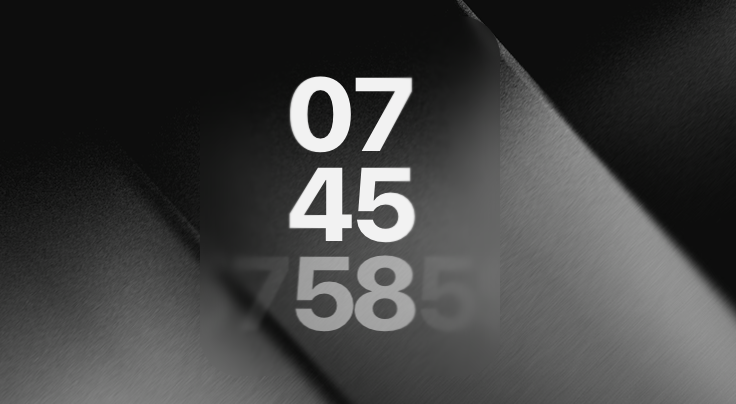

# Horizontal Clock Widget

A sleek horizontal clock widget featuring smooth animated seconds transitions with a parallax blur effect.

## Features

- **Horizontal seconds display** — A scrolling row of seconds with a bright center and fading edges
- **Smooth animation** — Seconds slide in with an ease-out cubic transition each tick
- **Depth blur layers** — Multi-layer backdrop blur with gradient masks creates a natural depth-of-field effect on the seconds row
- **Tabular numerals** — Fixed-width digits prevent layout shift

## Preview

## Usage

Install this widget in your widget framework (e.g. [Übersicht](https://github.com/felixhagework/uebersicht)) and it will display the current time with animated seconds.

## Details

| Property | Value |
|----------|-------|
| Width | 150 |
| Height | 180 |
| Font | Inter / SF Pro Display |

## Author

Mutawirr — [developerbola@icloud.com](mailto:developerbola@icloud.com)
